# PHẦN 1: FRAMEWORK & XÂY DỰNG RESTful API VỚI SPRING BOOT

## 1. Giới thiệu Framework Spring Boot

### 1.1. Khái niệm

Spring Boot là một framework phát triển ứng dụng web và RESTful API trên nền tảng Java, được xây dựng dựa trên Spring Framework.
Spring Boot giảm thiểu cấu hình, giúp lập trình viên tập trung vào logic nghiệp vụ thay vì xử lý các phần cài đặt phức tạp như servlet, XML hay build path.

### 1.2. Ưu điểm

1. **Tự động cấu hình (Auto Configuration):** Giúp khởi tạo nhanh ứng dụng mà không cần cấu hình thủ công
2. **Starter Dependencies:** Cung cấp các gói starter (như **spring-boot-starter-web**, **spring-boot-starter-data-jpa**, …) để thêm thư viện dễ dàng
3. **Embedded Server:** Có thể chạy trực tiếp trên Tomcat/Jetty mà không cần triển khai thủ công `.war`
4. **Dễ mở rộng và bảo trì:** Theo mô hình module MVC : Model – View – Controller
5. **Tích hợp tốt:** Với cơ sở dữ liệu, bảo mật, và dịch vụ REST

## 2. Cấu trúc Dự án Spring Boot

### 2.1. Khởi tạo Project

- Sử dụng Spring Initializr tại https://start.spring.io
- Project: Maven Project
- Language: Java
- Spring Boot Version: 3.x
- Dependencies: Spring Web, Spring Data JPA, MySQL Driver, Lombok, Spring Boot DevTools

<p align="center">
  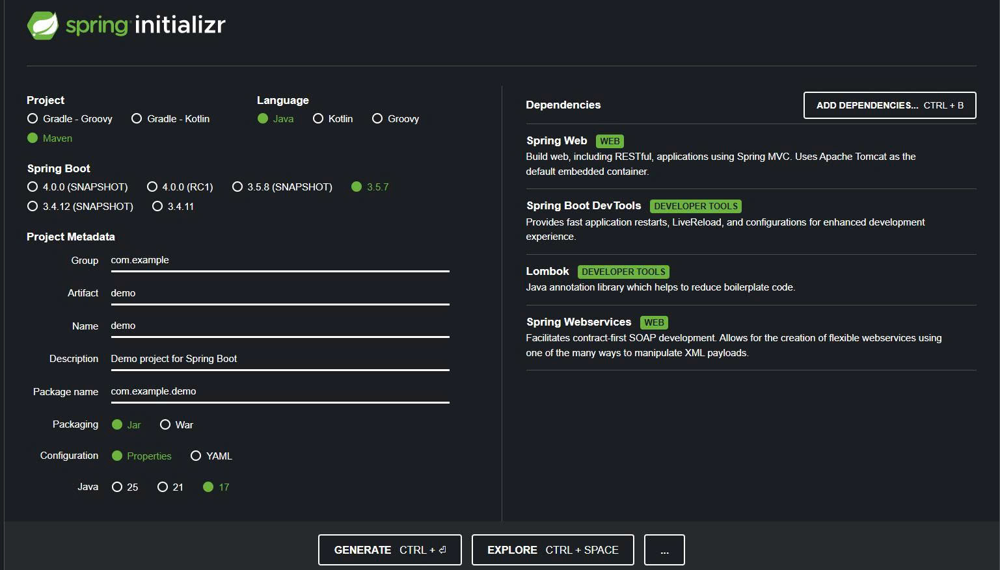
</p>

### 2.2. Cấu trúc thư mục

```
src/
 └── main/
      ├── java/com/example/demo/
      │     ├── controller/
      │     ├── model/
      │     ├── repository/
      │     ├── service/
      │     └── DemoApplication.java
      └── resources/
            ├── application.properties
            ├── static/
            └── templates/
```

Trong đó :

- Controller : Chứa các lớp xử lý request và định nghĩa API endpoint
- Model : Chứa các lớp Entity ánh xạ với bảng trong cơ sở dữ liệu
- Repository : Chứa interface kế thừa JpaRepository để truy cập DB
- Service : Chứa lớp xử lý logic nghiệp vụ, tách biệt với controller
- Resources : Chứa file cấu hình application.properties và tài nguyên tĩnh
- DemoApplication.java : Class khởi động chính của ứng dụng

## 3. File cấu hình: application.properties

File này chứa các cấu hình môi trường và thông tin kết nối cơ sở dữ liệu.

Ví dụ (lấy trong project furniture store em đang làm)

```
spring.jpa.hibernate.ddl-auto=update
spring.datasource.url=jdbc:mysql://${MYSQL_HOST:localhost}:3306/furniture_store
spring.datasource.username=root
spring.datasource.password=123456
spring.datasource.driver-class-name=com.mysql.cj.jdbc.Driver
spring.jpa.show-sql=true

# config spring security
# spring.security.user.name=anhducwszxje
# spring.security.user.password=123456

# default = 1MB
spring.servlet.multipart.max-file-size=50MB

# default = 10 MB (form data)
spring.servlet.multipart.max-request-size=50MB

# config session
spring.session.store-type=jdbc
spring.session.timeout=30m
spring.session.jdbc.initialize-schema=always

# config spring mail
spring.mail.host=smtp.gmail.com
spring.mail.port=587
spring.mail.username=furniturestoreonline247@gmail.com
spring.mail.password=zbqxwkcegpdafggt
spring.mail.properties.mail.smtp.auth=true
spring.mail.properties.mail.smtp.starttls.enable=true
```

## 4. RESTful API Cơ Bản

### 4.1. REST API là gì

- REST (Representational State Transfer) là phong cách thiết kế API cho phép giao tiếp giữa client và server qua giao thức HTTP.
- Mỗi endpoint trong REST API tương ứng với một tài nguyên (resource), ví dụ: api/products, api/users, ...

### 4.2. Các HTTP Methods cơ bản

- Phương thức GET : Dùng để lấy dữ liệu

      Ví dụ : /users/{id} : Lấy dữ liệu của người dùng có id là id truyền vào kia

- Phương thức POST : Dùng để thêm dữ liệu

      Ví dụ : /users/create : Thêm user mới

- Phương thức PUT : Dùng để cập nhật dữ liệu

      Ví dụ : /users/{id} : Cập nhật dữ liệu cho user có id là id truyền vào trong kia

- Phương thức DELETE : Dùng để xóa dữ liệu

      Ví dụ : /users/{id} : Xóa user có id là id truyền vào kia

## 5. Xây dựng Controller và Route

### Routes (Đường dẫn / Endpoint)

- Là địa chỉ URL mà client (ví dụ trình duyệt, Postman, hoặc app) gửi request đến server.

- Mỗi route ứng với một chức năng cụ thể trong API (ví dụ: lấy danh sách sản phẩm, thêm sản phẩm, xóa sản phẩm...).

- Một route thường kết hợp với HTTP Method để xác định hành động (HTTP Method đã đề cập ở trên)

### Controllers (Bộ điều khiển)

- Là lớp Java (trong Spring Boot) chứa các hàm xử lý logic cho từng route.

- Controller đón request, gọi service hoặc repository, rồi trả về Response.

- Thường được đánh dấu như ví dụ dưới :

```java
      @RestController
      @RequestMapping("/api/products")
```

<p align="center">
  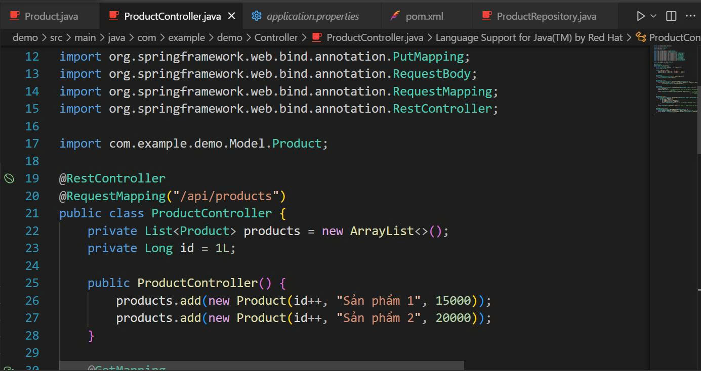
</p>

## 6. Xử lý Request và Response

### 6.1. Request

- @PathVariable: Dữ liệu trong đường dẫn
- @RequestParam: Dữ liệu truyền qua URL
- @RequestBody: Dữ liệu JSON từ Client

### 6.2. Response

Spring Boot tự động chuyển đối tượng Java → JSON thông qua Jackson.
Khi trả về dữ liệu, có thể dùng các trạng thái trả về như sau :

- return ResponseEntity.ok(object); // HTTP 200 => Thành công
- return ResponseEntity.status(HttpStatus.CREATED).body(object); // HTTP 201 => Tạo thành công (Created)
- return ResponseEntity.notFound().build(); // HTTP 404 (URL không tồn tại trên máy chủ)

# Báo cáo Output Phần 1 :

### Thông thường trong các project có liên kết với DB em sẽ sử dụng DI, nhưng với báo cáo phần 1 này chưa cần liên kết với DB nên em sẽ sử dụng để demo như các hình dưới cho đơn giản ví dụ (chi tiết về cách kia sẽ được thể hiện ở báo cáo Phần 2 khi đã kết nối với DB)

## Tổng quan về code :

### Trong Model Product :

<p align="center">
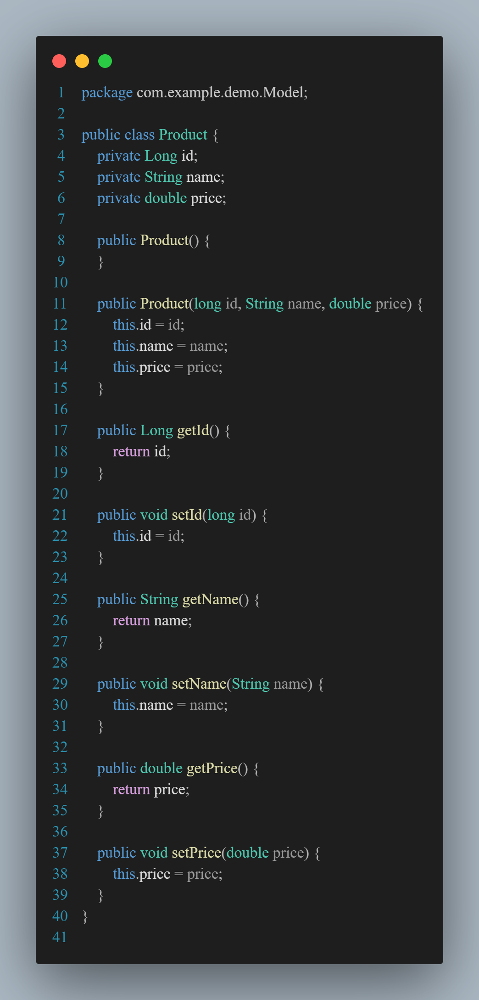
</p>

### Trong ProductController :

<p align="center">
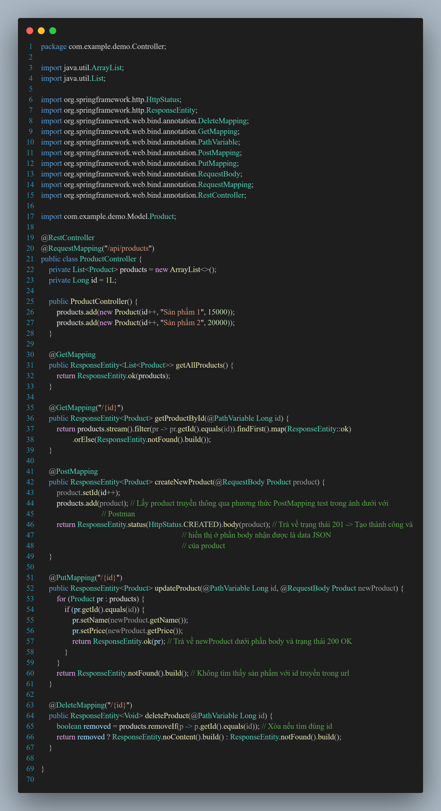
</p>

### Chi tiết các thao tác

- API GET /items → Lấy danh sách
  <p align="center">
  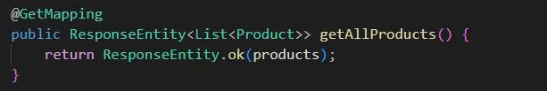
  </p>
  <p align="center">
  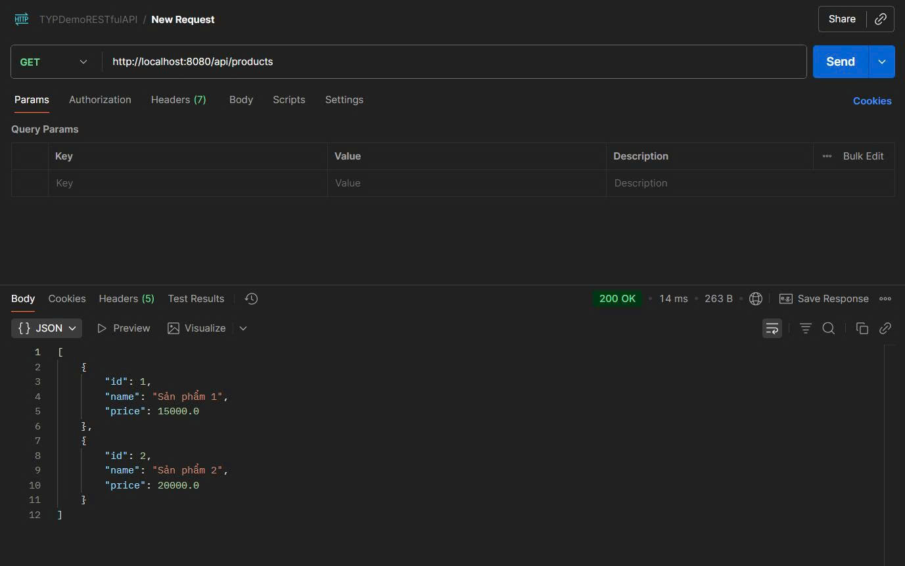
  </p>

- API GET /items/{id} → Lấy chi tiết
  <p align="center">
  
  </p>
  <p align="center">
  
  </p>
  Trường hợp lỗi không tìm thấy id truyền lên : Trả về 404 Not Found
  <p align="center">
  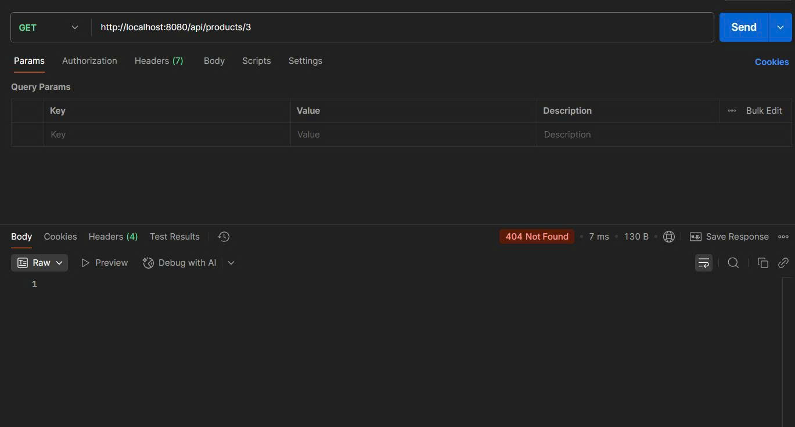
  </p>

- API POST /items → Thêm mới
  <p align="center">
  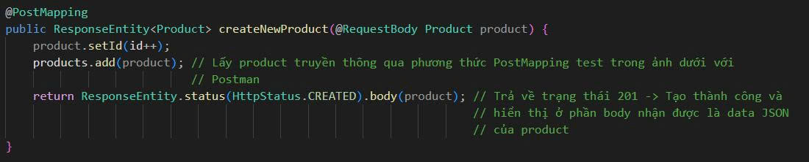
  </p>
  <p align="center">
  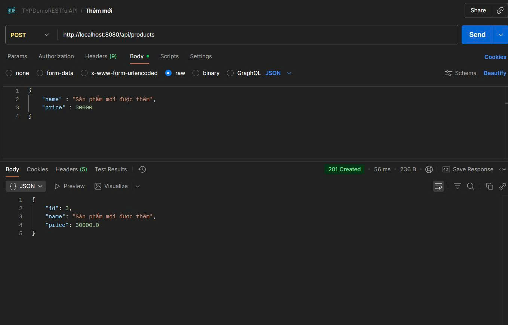
  </p>

- API PUT /items/{id} → Cập nhật
  <p align="center">
  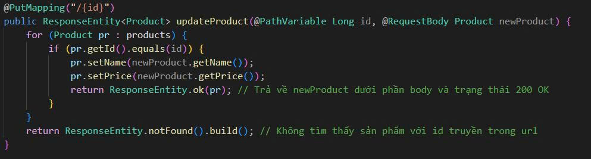
  </p>
  <p align="center">
  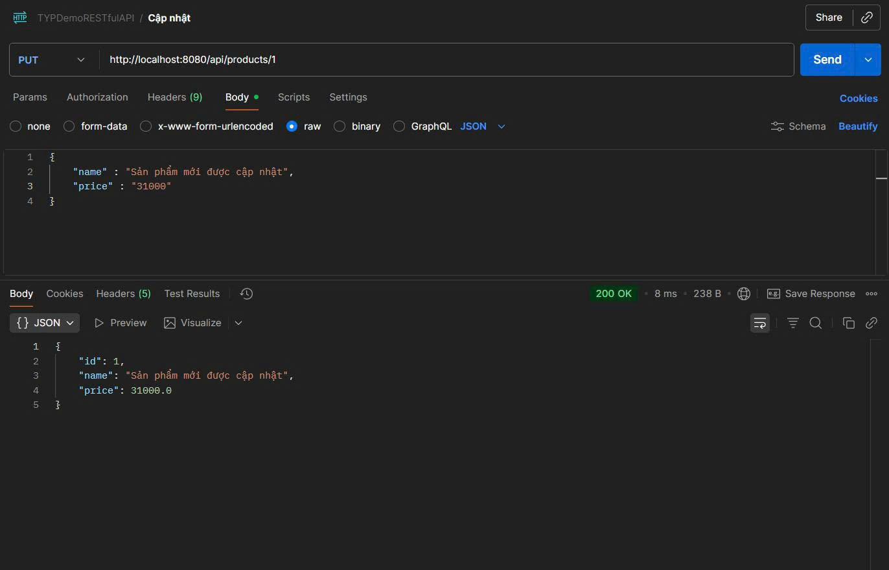
  </p>

## Video demo phần 1 :

<video src="./video/demo_phan1.mp4" controls width="720"></video>

# Phần 2: Tích hợp Database (ORM)

## 1. Khái niệm ORM

### ORM là gì?

ORM (Object-Relational Mapping) là kỹ thuật ánh xạ (mapping) giữa các đối tượng trong lập trình hướng đối tượng và các bảng trong cơ sở dữ liệu quan hệ (RDBMS).

=> ORM giúp ta làm việc với CSDL bằng đối tượng Java thay vì viết câu lệnh SQL trực tiếp

Ví dụ :

```java
      User user = new User();
      user.setName("anhducwszxje");
      user.setEmail("DucBA.B23CN165@stu.ptit.edu.vn");
      userRepository.save(user); // Trong dự án thì thường em viết theo mô hình DI
```

=> ORM sẽ tự động chuyển thành :

      INSERT INTO users (name, email) VALUES ('anhducwszxje', 'DucBA.B23CN165@stu.ptit.edu.vn');

### Lợi ích của ORM ?

- Giảm code SQL thủ công
- Tăng tính trừu tượng
- Dễ bảo trì và mở rộng
- Bảo mật & hiệu năng
- Tương thích đa DBMS

## 2. Sử dụng ORM theo framework

Ở đây em sử dụng Java (Spring Boot) => Sử dụng tích hợp ORM thông qua JPA và Hibernate

### JPA (Java Persistence API)

- Là chuẩn (specification) do Java EE định nghĩa để ánh xạ đối tượng Java với cơ sở dữ liệu.

- Nó chỉ định các annotation, interface, và API cần có (nhưng không tự thực thi).

- Hibernate là implementation cụ thể hiện thực hóa JPA.

### Hibernate

- Là framework ORM mạnh mẽ nhất cho Java.

- Quản lý vòng đời entity, cache, query, transaction, mapping, v.v.

- Tự động chuyển đổi các class Java thành bảng trong DB.

## 3. Cấu hình Spring Data JPA

### Trong pom.xml : Phải thêm dependency vào trong loạt dependencies

Cụ thể :

```java
<dependencies>
      ...
      <dependency>
      <groupId>org.springframework.boot</groupId>
      <artifactId>spring-boot-starter-data-jpa</artifactId>
      </dependency>
      <dependency>
      <groupId>com.mysql</groupId>
      <artifactId>mysql-connector-j</artifactId>
      </dependency>
      ...
</dependencies>
```

### Trong application.properties :

```java
spring.datasource.url=jdbc:mysql://localhost:3306<tên_schema>
spring.datasource.username=root
spring.datasource.password=123456
spring.datasource.driver-class-name=com.mysql.cj.jdbc.Driver
spring.jpa.hibernate.ddl-auto=update
spring.jpa.show-sql=true
spring.jpa.properties.hibernate.format_sql=true
```

## 4. Định nghĩa Entity

### Trong User.java :

```java
package com.example.laptopshop.model;

import jakarta.persistence.*;

@Entity
@Table(name = "users")
public class User {
    @Id
    @GeneratedValue(strategy = GenerationType.IDENTITY)
    private Long id;

    @Column(nullable = false)
    private String name;

    private String email;
    private String password;

    // Nếu cần Getters và Setters -> Source Action -> Generate
}
```

- @Entity : Đánh dấu class là Entity để JPA quản lý
- @Table(name = "users") : Đặt tên bảng là users
- @Id : Khóa chính
- @GeneratedValue : Tự động tăng giá trị
- @Column : Tùy chỉnh thuộc tính cho cột

## 5. Tạo Repository

### Trong UserRepository.java :

```java
package com.example.laptopshop.repository;

import org.springframework.data.jpa.repository.JpaRepository;
import com.example.laptopshop.model.User;

public interface UserRepository extends JpaRepository<User, Long> {
    User findByEmail(String email);
}
```

JpaRepository<T,ID> đã có sẵn các hàm CRUD

Có thể định nghĩa query tùy chỉnh theo quy tắc tên hàm Derived Query Method

## 6. Sử dụng trong Service

### Trong UserService :

```java
      @Service
      public class UserService {
            private UserRepository userRepository;

            public UserService(UserRepository userRepository) {
                  this.userRepository = userRepository;
            }

            public List<User> handleGetAllUsers() {
                  return this.userRepository.findAll();
            }
      }
```

# Báo cáo Phần 2 :

## Tải về cấu hình dự án :

<p align="center">
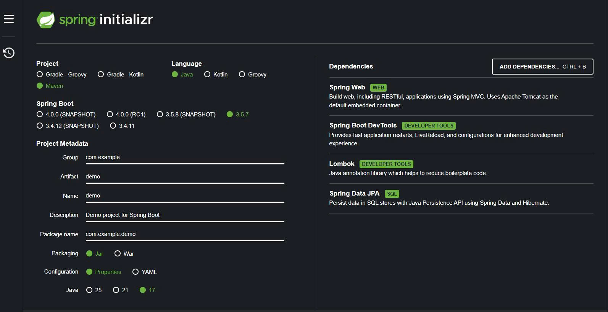
</p>

## Trong application.properties cấu hình để kết nối được với DB

<p align="center">
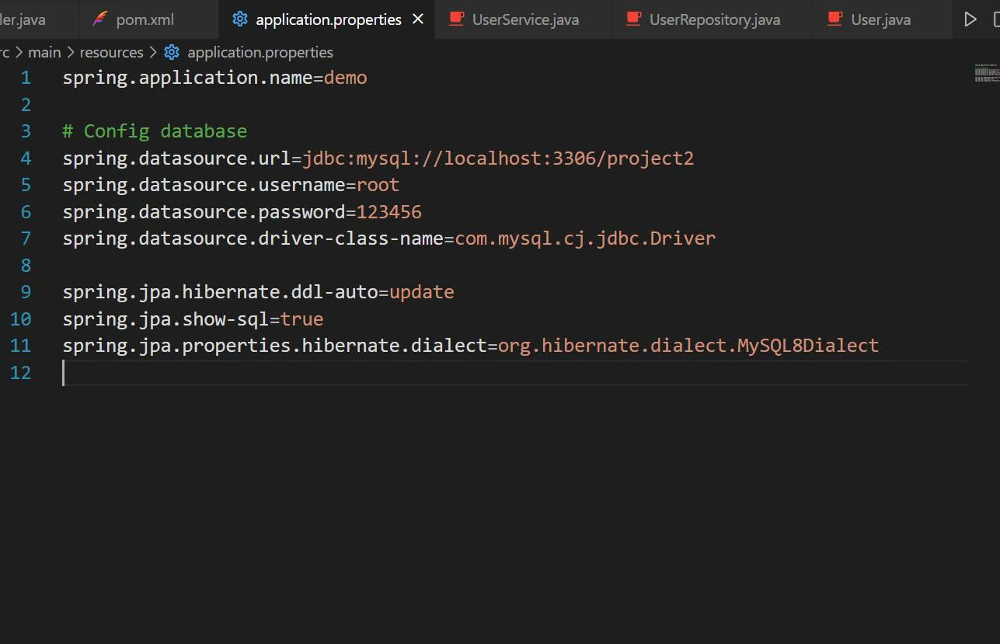
</p>

## Trong Entity đã có các Annotation để định nghĩa cho Entity :

<p align="center">
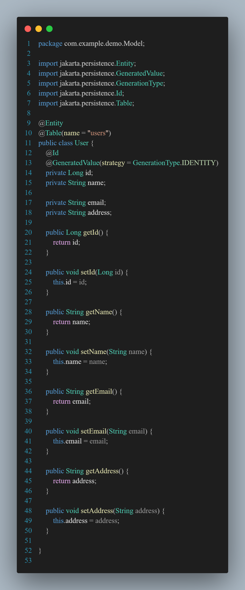
</p>

## Repository kết thừa JpaRepository :

<p align="center">

</p>

## Tổng quan về code :

### Trong Controller :

<p align="center">
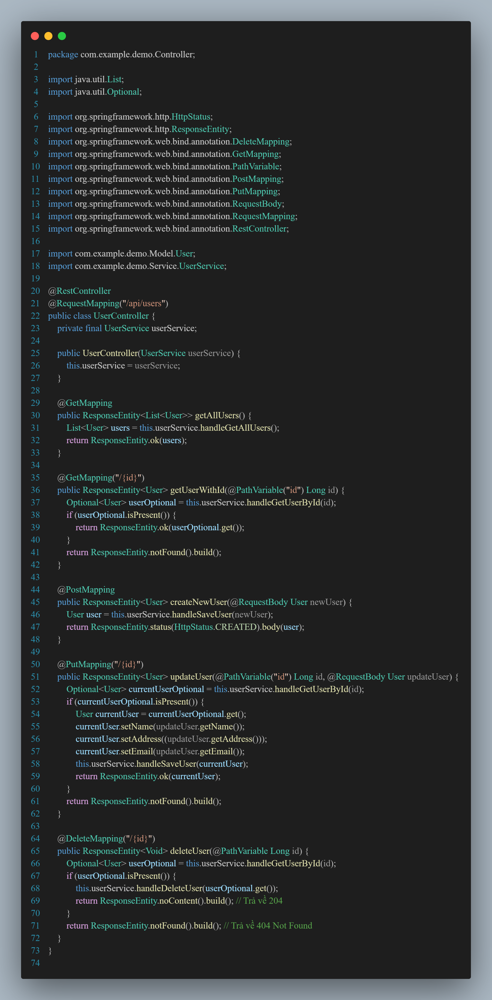
</p>

### Trong Service :

<p align="center">
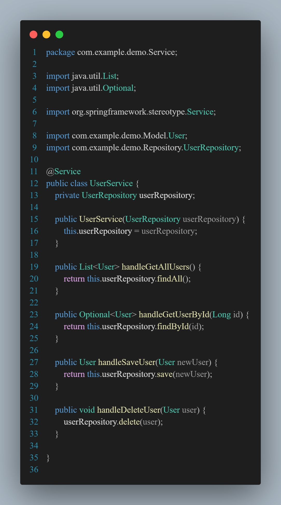
</p>

### Trong Repository :

<p align="center">

</p>

## Chi tiết các thao tác :

### Tạo mới user :

<p align="center">
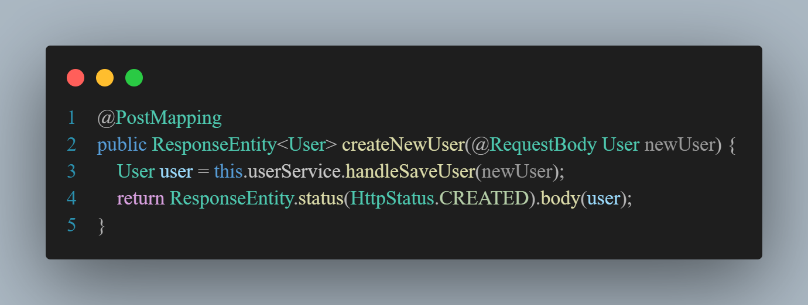
</p>

<p align="center">

</p>

Sau khi tạo mới user, kiểm tra database đã thấy :

<p align="center">
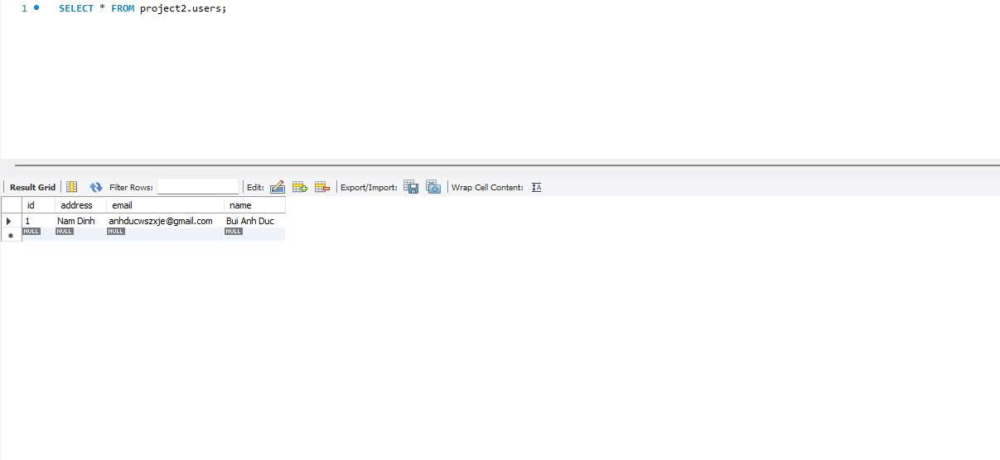
</p>

### Update user :

<p align="center">
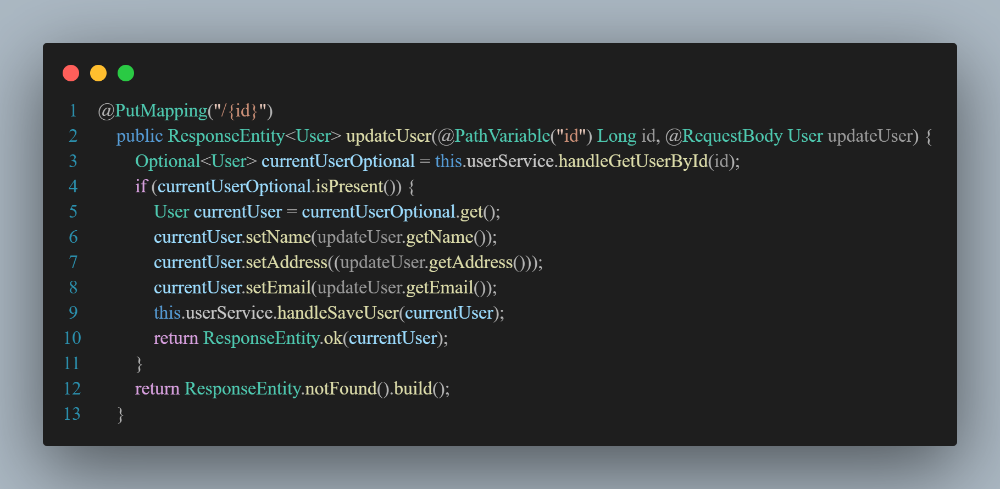
</p>

<p align="center">
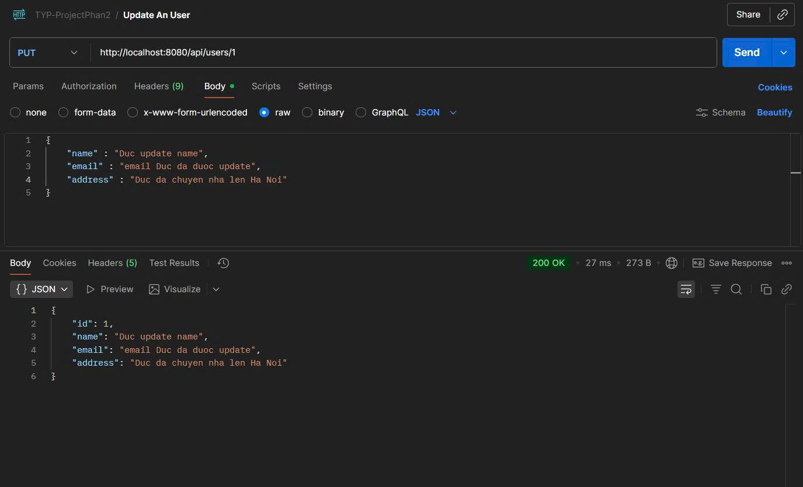
</p>

### Get an user : (Cùng là lấy ra user trong db nên em để update rồi lấy ra thông tin luôn)

<p align="center">
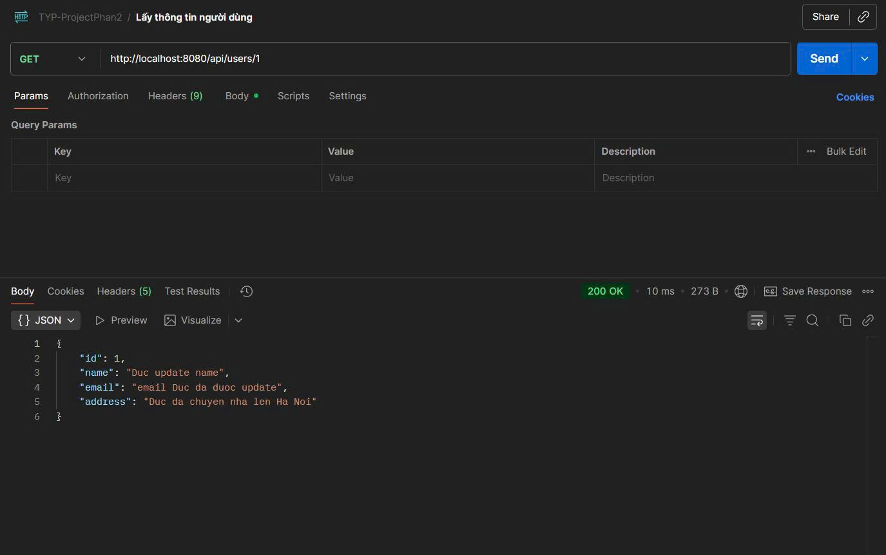
</p>

### Delete user :

<p align="center">
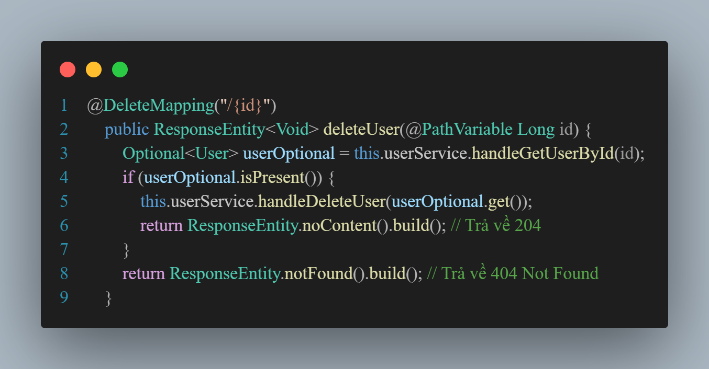
</p>

<p align="center">
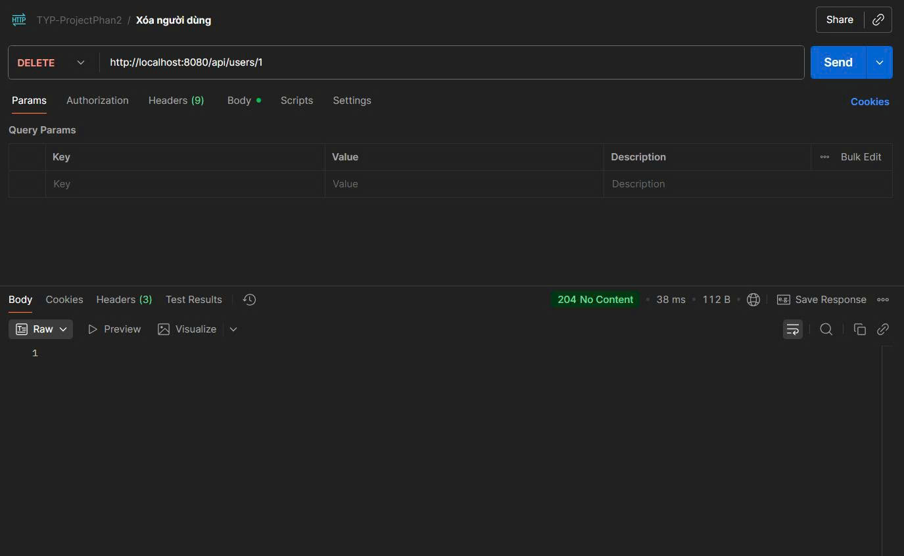
</p>

### Sau khi delete user :

<p align="center">
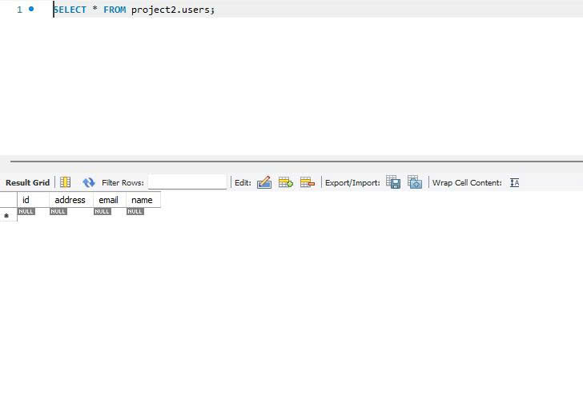
</p>

## Video demo phần 2 :

<video src="./video/demo_phan2.mp4" controls width="720"></video>
